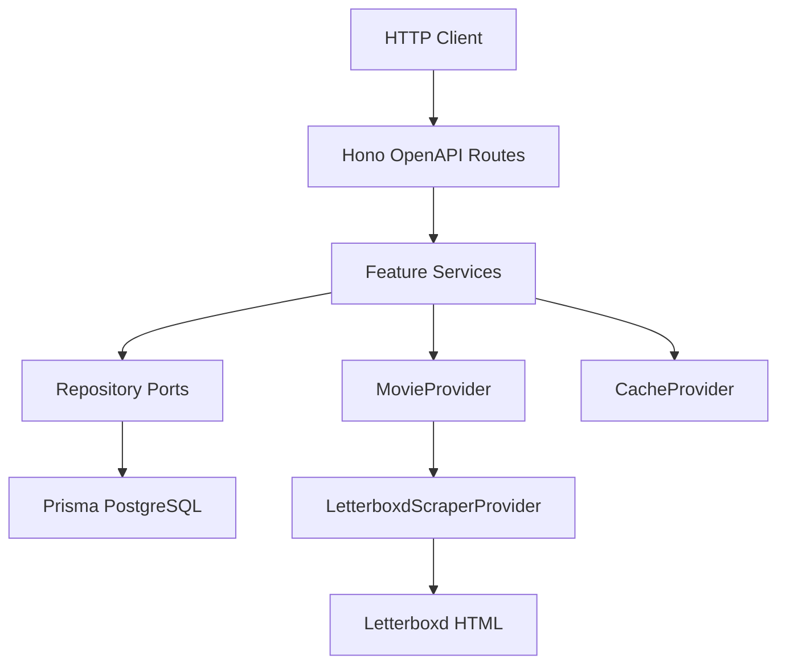
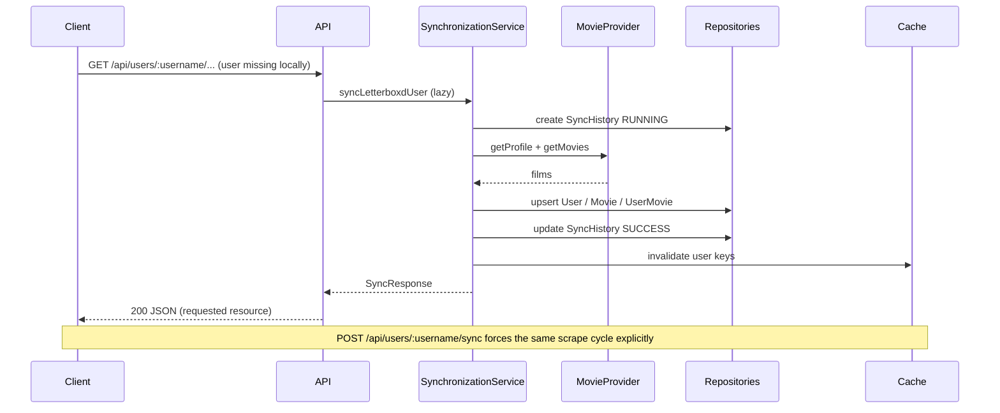

# Architecture

## Overview

Letterboxd API follows Clean Architecture with feature modules and a thin HTTP layer.

## Layers

| Layer | Responsibility |
| --- | --- |
| `app/` | Composition root, middleware, routing, env |
| `features/` | Use-cases: users, movies, ratings, sync, etc. |
| `infrastructure/` | Prisma, scraper, cache, logger, future external APIs |
| `shared/` | Errors, constants, pure utils, shared types |

## Dependency rule

- Features depend on **ports** (interfaces), not concrete adapters
- Adapters live in `infrastructure/` and are wired in `app/container.ts`
- No feature imports another feature's internals except shared contracts (schemas reused carefully)

## Synchronization sequence

## Extension points

| Port | Current impl | Future |
| --- | --- | --- |
| `MovieProvider` | `LetterboxdScraperProvider` | Official API if ever available |
| `CacheProvider` | `MemoryCache` | Redis / Upstash / Vercel KV |
| `RecommendationEngine` | `RuleBasedRecommendationEngine` | OpenAI + pgvector RAG |

## Serverless notes

- Prisma client is cached on `globalThis` to survive warm Vercel invocations
- Composition root is lazy via `getContainer()`
- Rate limiting is in-memory (per instance); swap to Redis for multi-instance accuracy
