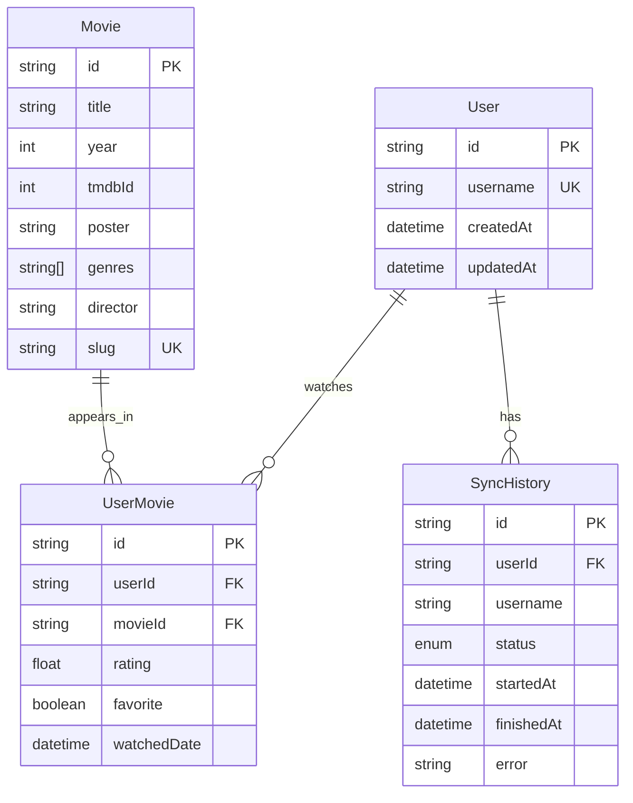

# Database

PostgreSQL via Prisma. Configure either discrete `DB_*` variables or a full `DATABASE_URL` (Supabase / managed). If both are set, `DATABASE_URL` wins.

Production database setup: **[supabase.md](supabase.md)** (Supavisor transaction pooler for runtime, Direct/Session for migrations). Deploy the API: **[vercel.md](vercel.md)**.

## ER diagram



## Models

- **User** — Letterboxd username identity
- **Movie** — canonical film keyed by Letterboxd `slug` (TMDB id reserved for v2)
- **UserMovie** — watch relationship with rating / favorite / date
- **SyncHistory** — audit trail for scrape jobs (`PENDING|RUNNING|SUCCESS|FAILED`)

## Migrations

Prisma is the **authoring** source (`prisma/schema.prisma` + `prisma/migrations/`). The same SQL is mirrored into `supabase/migrations/` for [Supabase GitHub integration](supabase.md#github-integration-migrations) (production apply without GitHub Actions DB secrets).

```bash
bun run db:migrate          # Prisma migrate dev + sync supabase/migrations
bun run db:sync:supabase    # regenerate supabase/migrations from Prisma only
bun run db:migrate:deploy   # Prisma apply (local / optional; prefer Supabase GitHub for hosted prod)
bun run db:studio           # GUI
```

Do not run Prisma `migrate deploy` and Supabase production deploy for the **same** new migration on one database.
