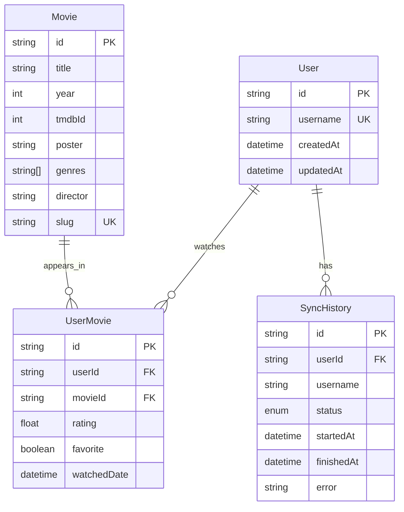

# Database

PostgreSQL via Prisma. Configure either discrete `DB_*` variables or a full `DATABASE_URL` (Supabase / managed). If both are set, `DATABASE_URL` wins.

## ER diagram



## Models

- **User** — Letterboxd username identity
- **Movie** — canonical film keyed by Letterboxd `slug` (TMDB id reserved for v2)
- **UserMovie** — watch relationship with rating / favorite / date
- **SyncHistory** — audit trail for scrape jobs (`PENDING|RUNNING|SUCCESS|FAILED`)

## Migrations

```bash
bun run db:migrate          # dev
bun run db:migrate:deploy   # prod / CI
bun run db:studio           # GUI
```

Initial migration lives in `prisma/migrations/`.
