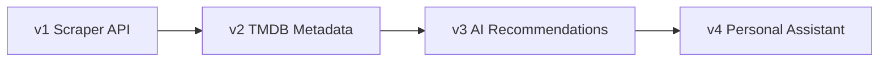

# Product Roadmap

See also root [ROADMAP.md](../ROADMAP.md).

## v1

Foundation API: scrape, store, filter, statistics.

## v2

Enrich films via TMDB (posters, genres, directors, cast).

## v3

OpenAI embeddings + pgvector ANN (+ optional LLM reasons). Full review-corpus RAG still pending.

## v4

Conversational assistant, Telegram bot, web dashboard, multi-source import.
